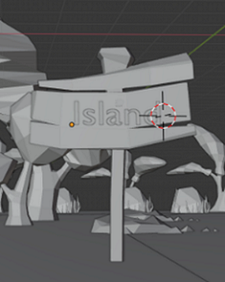
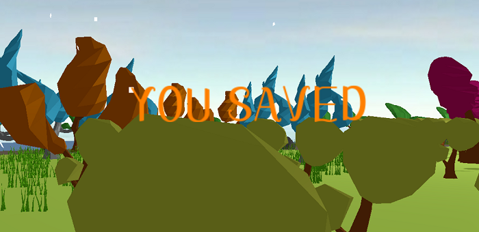
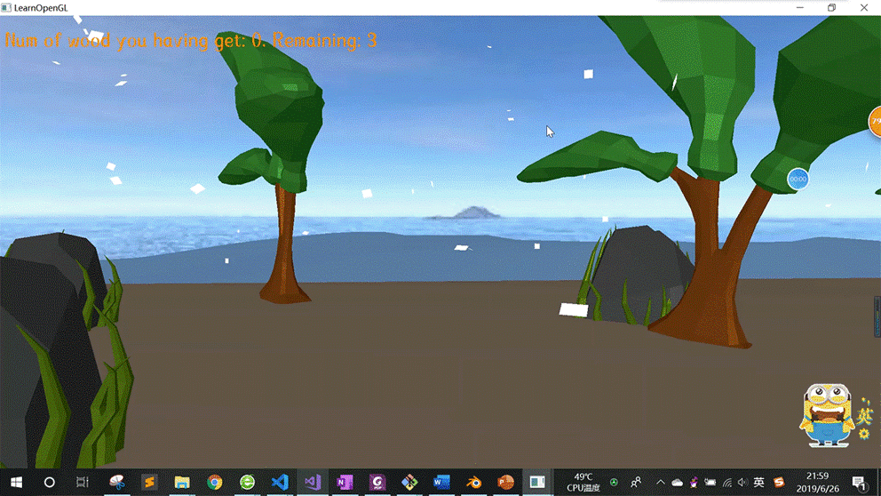

# 16340087黄悦
## 项目负责内容
#### 1. Blender建模并导入
使用卡通素材拼凑搭建场景  
   
纯色图片贴图，渲染出卡通的效果  
    

   

#### 2. 文本渲染
- Blender文本建模，和场景一起导入  
  

- 使用FreeType库
    - 加载本地字体库文件
    - TrueType字体是一些通过数学公式(曲线的组合)。这些字形，类似于矢量图像，可以根据需要的字体大小来生成像素图像。
    - 预先生成表示128个ASCII字符的字符表。并为每一个字符储存纹理和一些度量值。  
    ```
    // Load first 128 characters of ASCII set
	for (GLubyte c = 0; c < 128; c++)
	{
		// Load character glyph 
		if (FT_Load_Char(face, c, FT_LOAD_RENDER))
		{
			std::cout << "ERROR::FREETYTPE: Failed to load Glyph" << std::endl;
			continue;
		}
		// Generate texture
		GLuint texture;
		glGenTextures(1, &texture);
		glBindTexture(GL_TEXTURE_2D, texture);
		glTexImage2D(
			GL_TEXTURE_2D,
			0,
			GL_RED,
			face->glyph->bitmap.width,
			face->glyph->bitmap.rows,
			0,
			GL_RED,
			GL_UNSIGNED_BYTE,
			face->glyph->bitmap.buffer
		);
    ```
    - 根据需要使用这些存储好的纹理和度量值，渲染文字到屏幕上  
    ```
    std::string::const_iterator c;
	for (c = text.begin(); c != text.end(); c++)
	{
		Character ch = Characters[*c];

		GLfloat xpos = x + ch.Bearing.x * scale;
		GLfloat ypos = y - (ch.Size.y - ch.Bearing.y) * scale;

		GLfloat w = ch.Size.x * scale;
		GLfloat h = ch.Size.y * scale;
		// Update VBO for each character
		GLfloat vertices[6][4] = {
			{ xpos,     ypos + h,   0.0, 0.0 },
			{ xpos,     ypos,       0.0, 1.0 },
			{ xpos + w, ypos,       1.0, 1.0 },

			{ xpos,     ypos + h,   0.0, 0.0 },
			{ xpos + w, ypos,       1.0, 1.0 },
			{ xpos + w, ypos + h,   1.0, 0.0 }
		};
		// Render glyph texture over quad
		glBindTexture(GL_TEXTURE_2D, ch.TextureID);
		// Update content of VBO memory
		glBindBuffer(GL_ARRAY_BUFFER, VBO);
		glBufferSubData(GL_ARRAY_BUFFER, 0, sizeof(vertices), vertices); // Be sure to use glBufferSubData and not glBufferData

		glBindBuffer(GL_ARRAY_BUFFER, 0);
		// Render quad
		glDrawArrays(GL_TRIANGLES, 0, 6);
		// Now advance cursors for next glyph (note that advance is number of 1/64 pixels)
		x += (ch.Advance >> 6) * scale; // Bitshift by 6 to get value in pixels (2^6 = 64 (divide amount of 1/64th pixels by 64 to get amount of pixels))
	}
    ```

效果如图  
  
    

#### 流体模拟
- 绘制三角形网格
    - 按照三角形绘制时的顶点顺序生成顶点数组
    ```
    for (int y = 0; y < Y_SEGMENTS - 1; ++y)
	{
		if (y%2 == 0)
		{
			for (int x = 0; x < X_SEGMENTS; ++x)
			{
				indices.push_back( y      * (X_SEGMENTS)+x);
				indices.push_back((y + 1) * (X_SEGMENTS)+x);
			}
		}
		else
		{
			for (int x = X_SEGMENTS - 1; x >= 0; --x)
			{
				indices.push_back((y + 1) * (X_SEGMENTS)+x);
				indices.push_back( y      * (X_SEGMENTS)+x);
			}
		}
	}
    ```
    ```
    std::vector<float> pos_;
	for (unsigned int x = 0; x < X_SEGMENTS; ++x)
	{
		for (unsigned int y = 0; y < Y_SEGMENTS; ++y)
		{

			float xPos = float((float)x / X_SEGMENTS);
			float yPos = float((float)y / Y_SEGMENTS);
			float zPos = 0.0f;

			pos_.push_back(xPos);
			pos_.push_back(yPos);
			pos_.push_back(zPos);
		}
	}
    ```
    - 再以GL_TRIANGLE_STRIP方式绘制
    ```
    glGenVertexArrays(1, &VAO);
	glGenBuffers(1, &VBO);
	glGenBuffers(1, &EBO);
	glBindVertexArray(VAO);
	glBindBuffer(GL_ARRAY_BUFFER, VBO);
	glBufferData(GL_ARRAY_BUFFER, (X_SEGMENTS * Y_SEGMENTS * 3) * sizeof(float), &pos_[0], GL_DYNAMIC_DRAW);
	glBindBuffer(GL_ELEMENT_ARRAY_BUFFER, EBO);
	glBufferData(GL_ELEMENT_ARRAY_BUFFER, indices.size() * sizeof(unsigned int), &indices[0], GL_DYNAMIC_DRAW);
	glEnableVertexAttribArray(0);
	glVertexAttribPointer(0, 3, GL_FLOAT, GL_FALSE, 3 * sizeof(float), (void*)0);
	glBindVertexArray(0);
    ```
    ```
    glBindVertexArray(VAO);
    ……
    glDrawElements(GL_TRIANGLE_STRIP, indices.size(), GL_UNSIGNED_INT, 0);
    ```
- Gester波公式改变网格顶点坐标值
    - Gester波是一种广泛用于CG中水波的模拟的波形。形状比较接近真实的水波，而且计算量不大
    - 公式及参数含义如下
    
    - 渲染时传入时间值t，在着色器中随时间改变每个顶点的x，y，z坐标值
    ```
    float t = glfwGetTime();
	shader.setFloat("t", t);
    ```
    ```
    for (int i = 0; i < WAVE_COUNT; i++) {
        float frequency = 6 * PI / waveLength[i];
        float phase = speed[i] * frequency;
        steepness[i] = 1 / frequency / amplitude[i] / 3;

        float theta = dot(direction[i], vec2(xPos, yPos));

        float A = steepness[i] * amplitude[i] * direction[i].x;
        xPos += A * cos(theta * frequency + t * phase);

        A = steepness[i] * amplitude[i] * direction[i].y;
        yPos += A * cos(theta * frequency + t * phase);

        zPos += amplitude[i] * sin(theta * frequency + t * phase);

    }

    for (int i = 0; i < WAVE_COUNT; i++) {
        float frequency = 2 * PI / waveLength[i];
        float WA = frequency * amplitude[i];
        float phase = speed[i] * frequency;
        float DP = dot(direction[i], vec2(xPos, yPos));
        float S = sin(frequency * DP + phase * t);
        float C = cos(frequency * DP + phase * t);

        xNor += direction[i].x * WA * C;
        yNor += direction[i].y * WA * C;
        zNor += steepness[i] * WA * S;

    }
    ```

效果如下
  
  

## 个人总结  

这次计图期末项目，我主要负责Blender场景建模、文字渲染及流体模拟。  
Blender场景建模算是花了较长时间的，之前没有用过Blender，但为了让项目能更美观，就自己花时间学习它的用法，然后对场景建模。这里也特别感谢雨桐的帮助，让我在短时间内能对Blender从零上手。最终的效果自己还是比较满意的。  
然后也进行了文字渲染、流体模拟，这部分根据网上的教程学习，实现起来也比较顺利。  
最终的项目由大家共同完成，与预期的效果还是比较接近的，就我自己来说十分满意。整个学期的计图课程也告一段落，从课上的理论学习到课外的实践，我学到了不少东西，也从合作中收获了不少，就总结到这里吧~