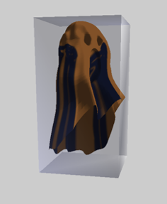
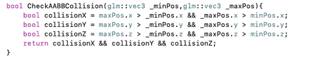
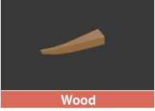
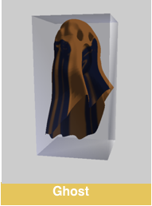
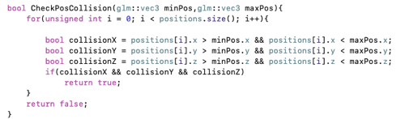
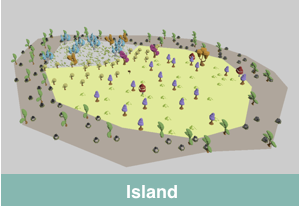
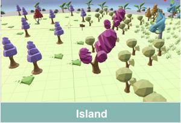

# 16340092 翦孟欣

## 项目负责内容

### 1. 视口转换

**玩家视角  &  自由视角**

* 玩家视角

  **玩法：**

  WSAD键控制玩家的转向和移动方向；

  摄像机视角固定。

  **实现：**

  更新LookAt矩阵，使得摄像机和玩家相对位置不变。

  

* 自由视角

  **玩法：**

  WSAD键：更新摄像机位置

  鼠标输入：更新欧拉角

  此时，玩家停止移动

  **实现：**

  之前的作业实现原理一致。

  

**空格键切换两种视角。**

### 2. 碰撞检测

#### **AABB盒**

AABB 包围盒就是采用一个长方体将物体包裹起来，进行两个物体的相交性检测时仅检测物体对应包围盒（包裹物体的长方体）的相交性。 

AABB 包围盒的 6 个参数分为两组：

$P_{min} : (x_{min}, y_{min}, z_{min})$

$P_{max} : (x_{max}, y_{max}, z_{max})$

其中，$P_{min}$ 是 3 个轴坐标最小值的集合，$P_{max}$ 是 3 个轴坐标最大值的集合。

**碰撞1 — ghost & wood**

两个AABB盒的碰撞：

分别判断 3 个轴方向的交叠部分大小是否大于设定的阈值，若大于则发生了碰撞，否则没有发生碰撞。

注：阈值处理在传参前已被处理。

**碰撞2 — ghost & island**

AABB盒(ghost)和点的集合(island)的碰撞：

判断模型的每个顶点是否在ghost的AABB盒内部，从而判断是否碰撞。

**优化算法：**

- 以 xOz 平面划分小区间，分块存放。
- 根据 ghost 位置，每次只对 ghost 当前所在块的所有顶点进行碰撞检测

## 个人总结

本次实验我主要负责视角转换和碰撞检测部分。

视角转换分为玩家视角和自由视角。玩家视角下，玩家能控制人物的前后左右移动，收集木桩。自由视角下，玩家能通过调整摄像机欣赏岛的美丽风光。

碰撞检测主要是通过AABB盒实现，ghost和木桩是两个AABB盒的碰撞，ghost和岛的场景是AABB盒和顶点的集合的碰撞。有个小技巧，因为岛上有很多低矮的草丛，为了避开草与ghost的碰撞，适当调高ghost的AABB盒的左下角点的 Y 坐标；为了增强ghost和木桩碰撞的灵敏度，适当调低AABB盒的 Y 坐标。

