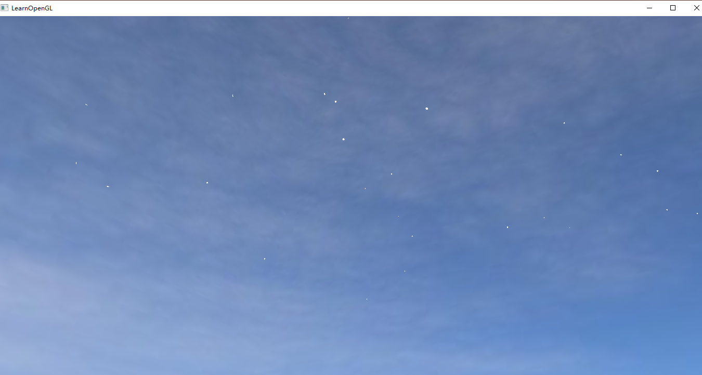

# 16340164 吕雪萌

## 项目负责内容

### 天空盒

- 使用立方体贴图的方式，变换观察矩阵移除位移部分，实现玩家一直处在天空盒中心。
- 使用PS软件，处理天空盒的图片的明度，色温，自己制作三套天空盒。
- 设置计时器，定时更换三套天空盒。


### 粒子系统

- 粒子效果，实现下雪场景 
	- 先创建一个结构体作为雪花粒子，定义粒子的物理属性：生命周期，速度，旋转，加速度，大小scale等属性
	```
	struct Particle {
		glm::vec3 position;
		glm::vec3 velocity;
		glm::vec3 acceleration;
		glm::vec2 rotateAngle;
		float rotateSpeed;
		float lifetime;
		float scale;
		float dec;
	};
	```
	- 再创建一个类作为粒子系统发生粒子，在指定的XOZ平面，随机发射不同大小的雪花粒子
	```class ParticleSystem {
		private:
			//xoz平面，高度
			float rangex, rangez, skyHeight;
			int number;
			//存储
			vector<Particle> particles;
			float lifetime, dec;
			glm::vec3 position, velocity, acceleration, scale;
			unsigned int VAO;
		public:
			//更新渲染
			ParticleSystem(int number, glm::vec3 genPosition, float range_x, float range_z, float skyHeight);
			void initParticleSystem();
			void Update(float dt, glm::vec3 pos);
			void Draw(Shader &shader);

		};
	```
	- 粒子系统类使用vector来存储雪花粒子，通过遍历vecotor来更新粒子的物理属性
	- 如果粒子生命周期减少到0或y坐标<0,更新粒子的属性到初始化的状态
  - 效果图
  
  
## 个人总结 

这学期的期末项目我负责天空盒和粒子系统的实现。

天空盒比较简单，learnopengl中有相关的教程，但粒子系统就花费了比较长的时间，上网找了一些博客，但都用glew来实现的，所以还是费了一些时间。

天空盒图片素材一开始预期是寻找卡通风的，但很难找到卡通类型的，自己画出来的比较丑，最后没有采用_(:з」∠)_ 没有好看的天空盒稍微有点遗憾。

整个学期的图形学课程结束，项目也由大家一起完成啦，自己从课程中学习到很多图形学的知识~感谢小组的同伴们！ 最后，老师和TA辛苦了！
