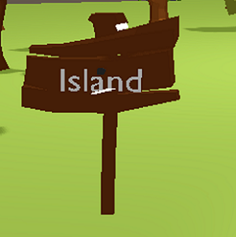
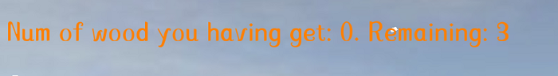
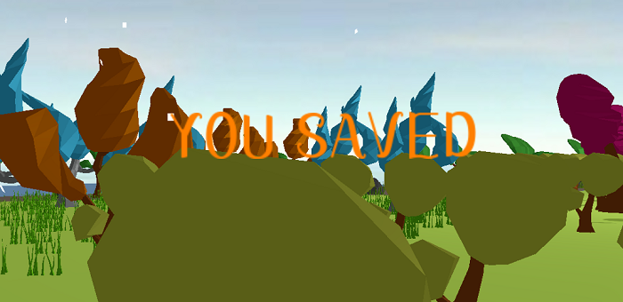
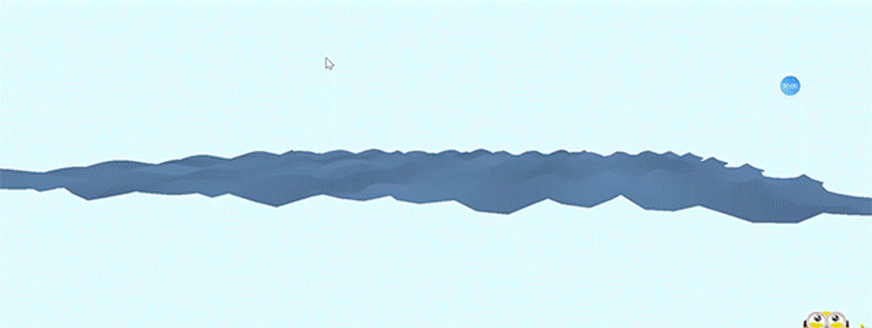
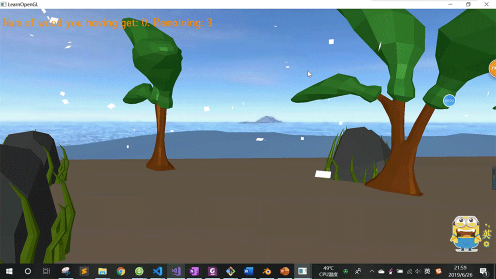
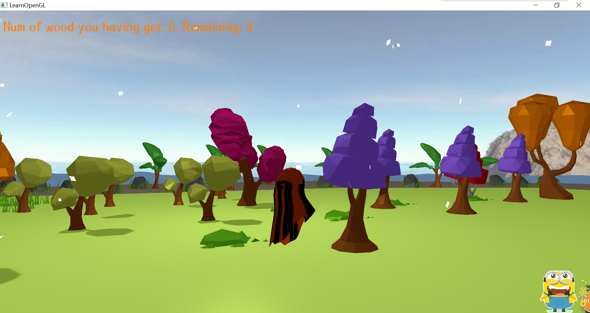
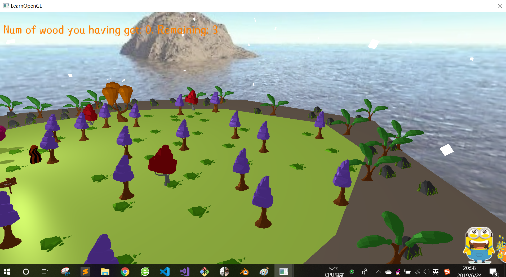

# Island Report
计图期末项目

| 姓名 | 学号 |
| ------ | ------ |
| 翦孟欣  | 16340092 |
| 黄悦    |  16340087 |
| 黎雨桐  |  16340110 |
| 吕雪萌   |  16340164 |  

## 项目介绍
- 项目简介
	- 我们小组的项目是一款逃生类的游戏。在这游戏中，玩家扮演的角色在一个神秘的岛屿上醒来。
    - 玩家只有收集足够的散落木桩，修建逃生船才能逃离小岛

- 开发环境：vs2017 + opengl
- 第三方库：glfw, glad, glm, assimp, freetype

## 功能列表

### 基础功能

- Camera Roaming
  - 参考learnopengl教程，实现鼠标以及键盘控制视角转换的效果，玩家视角&自由视角切换。
- Simple Lighting
  - 场景采用太阳光下的平行光源，使用Phong光照模型
- Texture Mapping
  - 我们对所有的模型使用纹理映射，实现草坪、石头、土地、天空盒的视觉效果。
- Shadow Mapping
  - 我们为主角幽灵以及其它部分模型实现了阴影。
- Model import
  - 我们利用blender制作了小幽灵，并利用现有模型碎片资源，自行搭建场景导入项目中。

### Bonus

- 天空盒的实现

  - 天空盒是一包含整个场景的立方体，通过给立方体内侧的六个表面贴图，让玩家产生巨大空间的错觉。

  - 天空盒的形式

    

  - 使用 loadCubemap 函数加载天空盒，参数为6个贴图的路径。

    ```c++
    unsigned int loadCubemap(vector<std::string> faces)
    {
        unsigned int textureID;
        glGenTextures(1, &textureID);
        glBindTexture(GL_TEXTURE_CUBE_MAP, textureID);
    
        int width, height, nrChannels;
        for (unsigned int i = 0; i < faces.size(); i++)
        {
            unsigned char *data = stbi_load(faces[i].c_str(), &width, &height, &nrChannels, 0);
            if (data)
            {
                glTexImage2D(GL_TEXTURE_CUBE_MAP_POSITIVE_X + i, 
                             0, GL_RGB, width, height, 0, GL_RGB, GL_UNSIGNED_BYTE, data
                );
                stbi_image_free(data);
            }
            else
            {
                std::cout << "Cubemap texture failed to load at path: " << faces[i] << std::endl;
                stbi_image_free(data);
            }
        }
        glTexParameteri(GL_TEXTURE_CUBE_MAP, GL_TEXTURE_MIN_FILTER, GL_LINEAR);
        glTexParameteri(GL_TEXTURE_CUBE_MAP, GL_TEXTURE_MAG_FILTER, GL_LINEAR);
        glTexParameteri(GL_TEXTURE_CUBE_MAP, GL_TEXTURE_WRAP_S, GL_CLAMP_TO_EDGE);
        glTexParameteri(GL_TEXTURE_CUBE_MAP, GL_TEXTURE_WRAP_T, GL_CLAMP_TO_EDGE);
        glTexParameteri(GL_TEXTURE_CUBE_MAP, GL_TEXTURE_WRAP_R, GL_CLAMP_TO_EDGE);
    
        return textureID;
    }
    ```

  - 天空盒使用立方体的位置作为纹理坐标来采样。顶点着色器将输入的位置向量作为输出给片段着色器的纹理坐标。片段着色器会将它作为输入来采样。

  - 天空盒显示：天空盒绑定立方体贴图纹理，将它变为场景中的第一个渲染的物体，并且禁用深度写入，以此实现天空盒被绘制在其他物体背后。

    ```c++
    glDepthMask(GL_FALSE);
    skyboxShader.use();
    // ... 设置观察和投影矩阵
    glBindVertexArray(skyboxVAO);
    glBindTexture(GL_TEXTURE_CUBE_MAP, cubemapTexture);
    glDrawArrays(GL_TRIANGLES, 0, 36);
    glDepthMask(GL_TRUE);
    ```

- 文字显示  
    - Blender文字建模实现场景中的路标  
    
    - FreeType库实现屏幕上的提示文字
      
      

- 流体模拟  
    - 先绘制一张三角形网格
    - Gester波公式改变网格顶点，实现岛屿周边海水的流动  
      
      

- 骨骼动画  
骨骼动画，实现玩家的行走，并且想尽可能实现一些动物的穿跃  

- 粒子效果  
	- 粒子效果，实现下雪场景 
	- 先创建一个结构体作为雪花粒子，定义粒子的物理属性：生命周期，速度，旋转，加速度，大小scale等属性
	```
	struct Particle {
		glm::vec3 position;
		glm::vec3 velocity;
		glm::vec3 acceleration;
		glm::vec2 rotateAngle;
		float rotateSpeed;
		float lifetime;
		float scale;
		float dec;
	};
	```
	- 再创建一个类作为粒子系统发生粒子，在指定的XOZ平面，随机发射不同大小的雪花粒子
	```class ParticleSystem {
		private:
			//xoz平面，高度
			float rangex, rangez, skyHeight;
			int number;
			//存储
			vector<Particle> particles;
			float lifetime, dec;
			glm::vec3 position, velocity, acceleration, scale;
			unsigned int VAO;
		public:
			//更新渲染
			ParticleSystem(int number, glm::vec3 genPosition, float range_x, float range_z, float skyHeight);
			void initParticleSystem();
			void Update(float dt, glm::vec3 pos);
			void Draw(Shader &shader);

		};
	```
	- 粒子系统类使用vector来存储雪花粒子，通过遍历vecotor来更新粒子的物理属性
	- 如果粒子生命周期减少到0或y坐标<0,更新粒子的属性到初始化的状态

- 碰撞检测（尚未完成）  
实现玩家在行走中对场景物体的碰撞检测

## 问题与解决方案

- 纹理导入出错：使用filesystem.h, 需要在项目属性的预处理器中，选择‘定义’，添加'_CRT_SECURE_NO_WARNINGS;'
- 模型导入问题：需要在'属性'->'链接器-输入'->'附加依赖项'中，添加assimp.lib库。 而且需要在项目.exe文件的同文件下添加assimp.dll文件才能正常运行。
- 天空盒贴图：需要注意文件路径以及贴图顺序。
- 主角幽灵动画效果  
幽灵是以模型导入，直接改变幽灵模型的顶点坐标来实现飘浮动画会比较麻烦，因此我们采用了帧动画的形式。每40次渲染，分别渲染不同状态的幽灵
```
    while (!glfwWindowShouldClose(window))
    {
        control++;
		if (control % 40 < 10) {
			renderScene(shader, ourModel1);
		}
		else if (control % 40 < 20) {
			renderScene(shader, ourModel2);
		}
		else if (control % 40 < 30) {
			renderScene(shader, ourModel3);
		}
		else {
			renderScene(shader, ourModel4);
		}
    }
```

## 实现结果
   

  

## 成员分工
**第一阶段实现**

| 姓名   | 主要负责                                       | 贡献  |
| ------ | ---------------------------------------------- | ----- |
| 翦孟欣 | 素材收集整理，模型的加载                       | 24.9% |
| 黄悦   | 基本环境搭建，包括光照明模型，阴影，纹理贴图等 | 24.9% |
| 黎雨桐 | Blender制作模型并导入                          | 25.3% |
| 吕雪萌 | 天空盒的实现                                   | 24.9% |

## 个人报告

- [16340087黄悦](PersonalReports/16340087_Report.md)
- [16340164吕雪萌](PersonalReports/16340164_Report.md)
